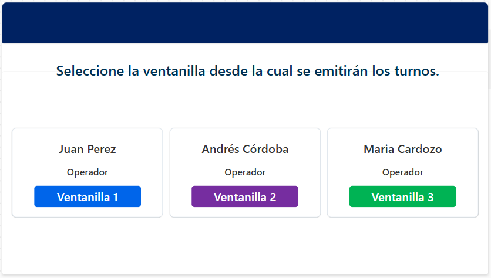
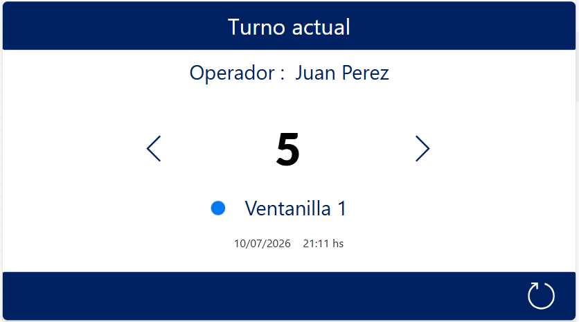
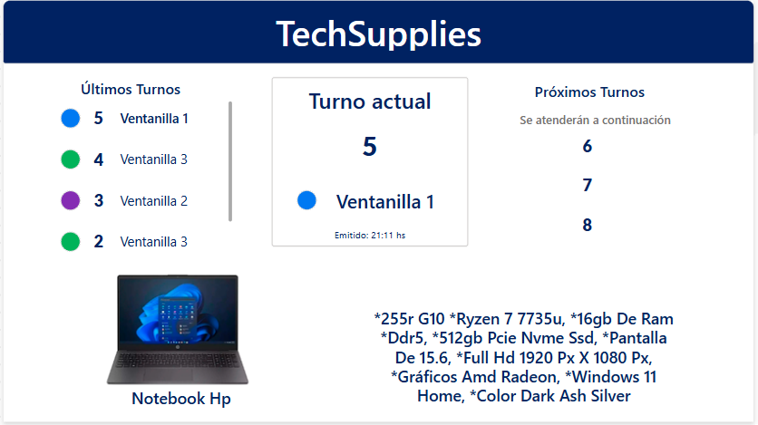
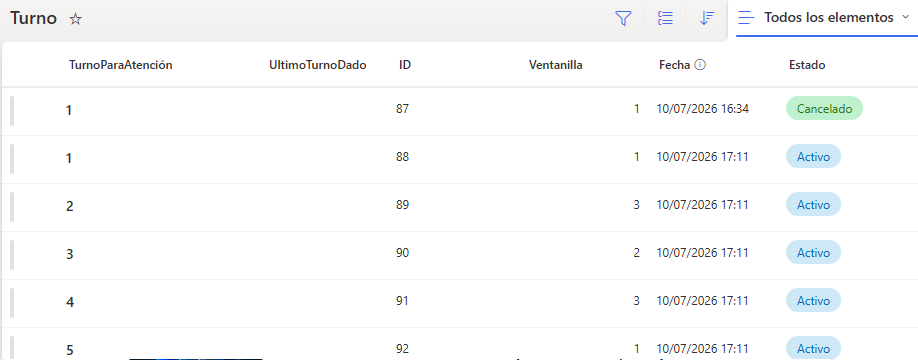
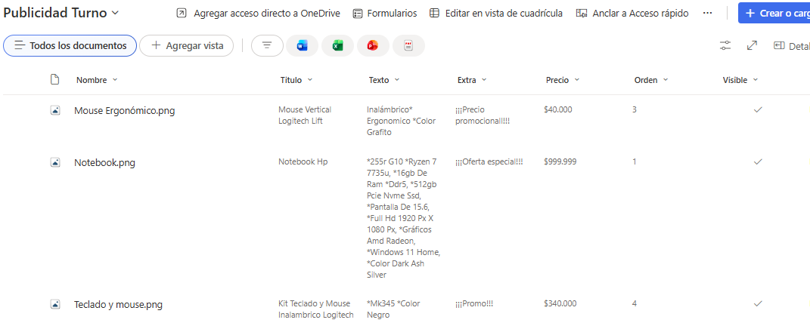

# Sistema de Gestión de Turnos y Publicidad

Aplicación desarrollada con **Microsoft Power Apps**, utilizando **SharePoint Online** como origen de datos y **Power Fx** para implementar la lógica de negocio.

La solución está compuesta por dos aplicaciones integradas que permiten administrar la emisión de turnos y mostrar información en tiempo real a los clientes mediante una pantalla pública.

# Contenido

- [Descripción del proyecto](#descripción-del-proyecto)
- [Objetivos](#objetivos)
- [Caso de negocio](#caso-de-negocio)
- [Tecnologías utilizadas](#tecnologías-utilizadas)
- [Arquitectura](#arquitectura)
- [Modelo de datos](#modelo-de-datos)
- [Aplicación 1 - Cambio de Turno](#aplicación-1---cambio-de-turno)
- [Aplicación 2 - Turno Publicitario](#aplicación-2---turno-publicitario)
- [Variables principales](#variables-principales)
- [Flujo de funcionamiento](#flujo-de-funcionamiento)
- [Funcionalidades implementadas](#funcionalidades-implementadas)
- [Diseño de la interfaz](#diseño-de-la-interfaz)
- [Decisiones de diseño](#decisiones-de-diseño)
- [Características destacadas](#características-destacadas)
- [Integración con SharePoint](#integración-con-sharepoint)
- [Conceptos de Power Platform aplicados](#conceptos-de-power-platform-aplicados)
- [Posibles mejoras futuras](#posibles-mejoras-futuras)
- [Buenas prácticas aplicadas](#buenas-prácticas-aplicadas)
- [Conclusión](#conclusión)

---

# Descripción del proyecto

El Sistema de Gestión de Turnos y Publicidad es una solución desarrollada con Microsoft Power Platform para administrar el proceso de atención al cliente mediante un sistema de turnos.

La solución integra dos aplicaciones conectadas al mismo origen de datos en SharePoint Online.

La primera aplicación permite a los operadores emitir y administrar turnos desde distintas ventanillas, mientras que la segunda presenta en una pantalla pública el turno actual, los próximos turnos y publicidad de productos, actualizando la información automáticamente.

---

# Objetivos

El proyecto fue desarrollado con los siguientes objetivos:

- Administrar turnos desde múltiples ventanillas.
- Registrar automáticamente cada turno emitido.
- Mantener un historial de atención.
- Mostrar el turno que está siendo atendido.
- Informar los próximos turnos.
- Compartir información en tiempo real entre ambas aplicaciones.
- Mostrar publicidad dinámica de productos.
- Mejorar la experiencia de atención mediante una interfaz clara e intuitiva.

---

# Caso de negocio

TechSupplies es una empresa dedicada a la comercialización de productos tecnológicos que recibe diariamente clientes para realizar distintas operaciones.

Para organizar el flujo de atención, cada operador trabaja desde una ventanilla específica y utiliza una aplicación para emitir nuevos turnos.

Mientras esperan ser atendidos, los clientes visualizan una pantalla pública donde pueden consultar el turno actual, la ventanilla correspondiente, los próximos turnos y promociones comerciales.

Ambas aplicaciones comparten la información almacenada en SharePoint Online, permitiendo que cualquier turno emitido se refleje inmediatamente en la pantalla destinada a los clientes.

---

# Capturas de la aplicación

## Selección de ventanilla



---

## Emisión de turnos



---

## Turno actual y publicidad



---

# Tecnologías utilizadas

| Tecnología | Función |
|------------|---------|
| Microsoft Power Apps | Desarrollo de ambas aplicaciones |
| SharePoint Online | Almacenamiento centralizado de datos |
| Power Fx | Implementación de la lógica de negocio |
| Controles modernos | Construcción de la interfaz de usuario |
| Variables globales y de contexto | Administración del estado de la aplicación |

---

# Arquitectura

```text
                 Operador
                     │
                     ▼
      Power Apps - Cambio de Turno
                     │
                     ▼
             SharePoint Online
          ┌──────────┴──────────┐
          ▼                     ▼
   Lista de Turnos      Biblioteca Publicidad
          └──────────┬──────────┘
                     ▼
     Power Apps - Turno Publicitario
                     │
                     ▼
                  Clientes
```

Ambas aplicaciones utilizan SharePoint Online como origen de datos común, permitiendo mantener sincronizada la información en tiempo real sin duplicar registros. Esta arquitectura desacopla la lógica de cada aplicación y facilita el mantenimiento de la solución.

---

# Modelo de datos

## Lista de Turnos

| Campo | Tipo | Descripción |
|--------|------|-------------|
| TurnoParaAtención | Texto | Número del turno emitido |
| UltimoTurnoDado | Número | Último turno generado |
| Ventanilla | Número | Ventanilla que emitió el turno |
| Fecha | Fecha y hora | Fecha y hora de emisión |
| Estado | Opción | Activo / Cancelado |

## Biblioteca Publicidad Turno

| Campo | Tipo | Descripción |
|--------|------|-------------|
| Imagen | Imagen | Imagen del producto |
| Texto | Texto | Nombre o descripción |
| Precio | Texto | Precio promocional |

---

# Aplicación 1 - Cambio de Turno

Aplicación utilizada por los operadores para administrar la atención de clientes desde las distintas ventanillas.

Permite emitir nuevos turnos, cancelar el último turno generado y reiniciar el sistema cuando es necesario.

## Pantallas

### Selección de ventanilla

El operador selecciona la ventanilla desde la cual trabajará durante la sesión.

La aplicación almacena:

- Número de ventanilla.
- Nombre del operador.

Posteriormente navega hacia la pantalla principal.

### Cambio de Turno

Desde esta pantalla el operador puede:

- Emitir nuevos turnos.
- Cancelar el último turno activo.
- Reiniciar el sistema.
- Visualizar el turno actual.
- Visualizar la ventanilla activa.
- Visualizar el operador.
- Consultar la fecha y hora del último turno emitido.

Cada nuevo turno registra automáticamente:

- Número de turno.
- Ventanilla.
- Fecha y hora.
- Estado.

---

# Aplicación 2 - Turno Publicitario

Aplicación destinada a los clientes que esperan ser atendidos.

Obtiene la información directamente desde SharePoint Online y la actualiza automáticamente para mostrar el estado actual de la atención junto con publicidad dinámica.

## Secciones

### Turno actual

Muestra:

- Número del turno actual.
- Ventanilla correspondiente.
- Color identificatorio de la ventanilla.

Cuando no existen turnos emitidos se informa mediante un mensaje.

### Últimos turnos

Presenta los últimos turnos emitidos junto con la ventanilla correspondiente.

Cada ventanilla posee un color distintivo para facilitar su identificación.

### Próximos turnos

Calcula automáticamente los próximos números que serán llamados.

### Publicidad

Consume una biblioteca de imágenes almacenada en SharePoint.

Cada publicidad presenta:

- Imagen.
- Nombre del producto.
- Descripción.
- Precio.

La información rota automáticamente mediante temporizadores.

---

# Variables principales

## Cambio de Turno

| Variable | Función |
|----------|---------|
| var_ventanilla_actual | Almacena la ventanilla seleccionada |
| var_operador | Almacena el nombre del operador |
| var_last | Guarda el próximo número de turno |

## Turno Publicitario

| Variable | Función |
|----------|---------|
| var_actual | Publicidad actualmente mostrada |
| var_imagen_publicidad | Imagen visible |
| var_fase | Alterna entre descripción y precio |
| var_orden | Controla el recorrido de las publicidades |
| var_ultima_imagen | Cantidad total de publicidades |
| coll_images | Colección local utilizada para cargar las imágenes |

---

# Flujo de funcionamiento

```text
Seleccionar ventanilla
        │
        ▼
Ingresar a Cambio de Turno
        │
        ▼
Emitir nuevo turno
        │
        ▼
Guardar información en SharePoint
        │
        ▼
Actualizar automáticamente ambas aplicaciones
        │
        ▼
Mostrar turno actual
        │
        ▼
Actualizar próximos turnos
        │
        ▼
Actualizar publicidad
```

El uso de un único origen de datos permite que ambas aplicaciones permanezcan sincronizadas en tiempo real, evitando inconsistencias y duplicación de información.

---

# Funcionalidades implementadas

## Cambio de Turno

- Selección de ventanilla.
- Identificación del operador.
- Emisión de nuevos turnos.
- Cancelación del último turno emitido.
- Reinicio completo del sistema.
- Registro automático de fecha y hora.
- Registro de la ventanilla emisora.
- Persistencia de la información en SharePoint.
- Gestión del estado de cada turno (Activo / Cancelado).

## Turno Publicitario

- Consulta automática de la información almacenada en SharePoint.
- Visualización del turno actual.
- Visualización del historial reciente de turnos.
- Cálculo automático de los próximos turnos.
- Publicidad rotativa de productos.
- Alternancia automática entre descripción y precio.
- Identificación visual de ventanillas mediante colores.

---

# Diseño de la interfaz

La interfaz fue diseñada priorizando la claridad de la información y la facilidad de uso tanto para operadores como para clientes.

Para ello se implementaron las siguientes características:

- Uso de contenedores modernos para organizar los elementos visuales.
- Tarjetas para agrupar información relacionada.
- Colores distintivos para identificar cada ventanilla.
- Encabezados con una identidad visual uniforme.
- Tipografía Segoe UI en toda la aplicación.
- Distribución adaptable de los controles.
- Jerarquía visual mediante tamaños de fuente y espaciado.

---

# Decisiones de diseño

Durante el desarrollo se adoptaron distintos criterios para mejorar la experiencia de usuario:

- Mantener una identidad visual consistente entre ambas aplicaciones.
- Utilizar colores específicos para identificar rápidamente cada ventanilla.
- Mostrar únicamente la información relevante para cada tipo de usuario.
- Integrar la publicidad sin interferir con la información de atención.
- Actualizar automáticamente la pantalla pública sin intervención del operador.
- Centralizar toda la información en SharePoint para evitar duplicación de datos.

---

# Características destacadas

Entre las principales características de la solución se destacan:

- Integración entre dos aplicaciones mediante un mismo origen de datos.
- Sincronización de información en tiempo real.
- Emisión y seguimiento de turnos.
- Publicidad dinámica administrada desde SharePoint.
- Interfaz moderna basada en contenedores.
- Identificación visual mediante colores.
- Código organizado utilizando nombres descriptivos para controles y variables.
- Implementación de lógica mediante Power Fx.

---

# Integración con SharePoint

SharePoint Online actúa como repositorio central de información para ambas aplicaciones.

La solución utiliza:

## Lista de Turnos

Almacena toda la información relacionada con la emisión de turnos, incluyendo:

- Número de turno.
- Ventanilla.
- Fecha y hora.
- Estado.

## Biblioteca Publicidad Turno

Contiene las imágenes utilizadas por la pantalla publicitaria junto con la información descriptiva de cada producto.

Esta arquitectura permite actualizar tanto los turnos como el contenido publicitario sin necesidad de modificar las aplicaciones.

---

# Capturas de SharePoint

## Lista de Turnos



---

## Biblioteca Publicidad



---

# Conceptos de Power Platform aplicados

Durante el desarrollo se implementaron diversos conceptos propios de Microsoft Power Platform, entre ellos:

- Variables globales.
- Variables de contexto.
- Colecciones.
- Navegación entre pantallas.
- Formularios.
- Controles modernos.
- Funciones Filter, Sort, LookUp y Patch.
- Manipulación de registros en SharePoint.
- Temporizadores.
- Actualización automática de datos.
- Lógica de negocio mediante Power Fx.

---

# Posibles mejoras futuras

La solución fue diseñada para permitir futuras ampliaciones. Algunas funcionalidades que podrían incorporarse son:

- Pantalla de administración de ventanillas.
- Gestión de múltiples sucursales.
- Priorización de turnos.
- Notificaciones automáticas.
- Estadísticas de atención.
- Panel de indicadores.
- Integración con Power BI.
- Emisión de tickets mediante impresora.

---

# Buenas prácticas aplicadas

Durante el desarrollo de la solución se aplicaron distintas estrategias para mejorar la organización de la aplicación, facilitar su mantenimiento y optimizar la experiencia de usuario.

---

## Separación de responsabilidades

La solución fue dividida en dos aplicaciones independientes con responsabilidades claramente definidas:

- **Cambio de Turno**, destinada a la emisión y administración de turnos por parte de los operadores.
- **Turno Publicitario**, orientada a la visualización del turno actual, los próximos turnos y la publicidad para los clientes.

Esta separación permitió simplificar el mantenimiento y mantener desacoplada la lógica de cada aplicación.

---

## Centralización de la información

Ambas aplicaciones comparten una única fuente de datos mediante **SharePoint Online**, permitiendo mantener toda la información sincronizada en tiempo real.

Esta estrategia evita inconsistencias entre aplicaciones y facilita la administración de los datos.

---

## Implementación de la lógica mediante Power Fx

La lógica de negocio fue desarrollada utilizando **Power Fx**, aplicando funciones para consultar, actualizar y administrar la información almacenada en SharePoint.

Entre las principales funciones utilizadas se encuentran:

- Patch.
- Filter.
- LookUp.
- Sort.
- Variables globales.
- Variables de contexto.
- Colecciones.

Esta organización permitió desarrollar una aplicación más mantenible y sencilla de extender.

---

## Actualización en tiempo real

La solución fue diseñada para reflejar automáticamente los cambios realizados sobre SharePoint, garantizando que operadores y clientes visualicen siempre información actualizada durante el proceso de atención.

---

## Diseño orientado a la experiencia de usuario

La interfaz fue diseñada para facilitar la operación diaria mediante una distribución clara de la información y una navegación sencilla.

Además, la pantalla publicitaria permite visualizar en tiempo real el turno actual, los próximos turnos y contenido publicitario, mejorando la experiencia de espera de los clientes.

---

# Conclusión

El Sistema de Gestión de Turnos y Publicidad permitió desarrollar una solución integrada utilizando Microsoft Power Apps y SharePoint Online para administrar la emisión de turnos y visualizar información en tiempo real.

La integración de ambas aplicaciones mediante un único origen de datos facilitó la sincronización de la información entre operadores y clientes, incorporando además un sistema de publicidad dinámica administrado desde SharePoint.

Durante el desarrollo se aplicaron conceptos como variables, colecciones, formularios, navegación entre pantallas, temporizadores, manipulación de datos y lógica implementada mediante Power Fx.

Como resultado, se obtuvo una solución organizada, escalable y de fácil mantenimiento, orientada a optimizar el proceso de atención al cliente y mejorar la experiencia de uso tanto para operadores como para clientes.
